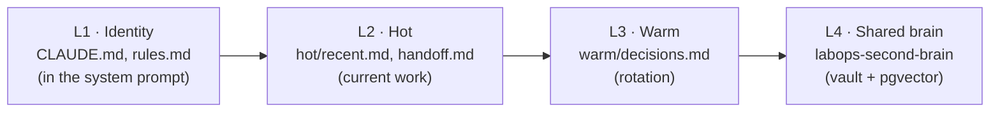
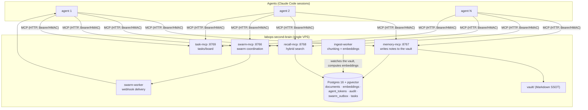

<p align="center">
  
</p>

<h1 align="center">labops-second-brain</h1>

<p align="center"><em>операционка с AI изнутри профессии</em></p>

<p align="center">
  <a href="https://labopsai.pro"></a>
  <a href="./LICENSE"></a>
  
</p>

<p align="center"><a href="README.md"><b>English</b></a> · <a href="README.ru.md">Русский</a></p>

<p align="center">
  <b>Система labops:</b>
  <a href="https://github.com/dediukhinpa/labops-tg-plugin">tg-plugin</a> ·
  <b>second-brain</b> ·
  <a href="https://github.com/dediukhinpa/labops-agent-architecture">agent-architecture</a>
</p>

> **A shared brain for a team of Claude Code agents.** Self-hosted on a single VPS: Postgres 16 + pgvector, a set of MCP servers (memory, hybrid recall, swarm coordination, tasks) and background workers. A Markdown vault as the single source of truth + semantic search on top of it. Part of the **labops** architecture (see [`labops-tg-plugin`](#part-of-labops) and [`labops-agent-architecture`](#part-of-labops)).

This is the **long-term shared memory** layer. Each agent keeps its own "hot" memory in its workspace (`CLAUDE.md`, `hot/`, `warm/`), while `labops-second-brain` is **L4**: semantic, shared across the whole team, with embedding search and strict access control.

> **Platform:** built for **Linux + systemd + Postgres peer-auth** (OS user == pg role, usually `second_brain`). Not Docker, not macOS/Windows.

---

## Why a shared memory backend

A single agent remembers its own session. A team of agents does not: knowledge gained by one is invisible to the others, is lost on compaction, and cannot be searched by meaning. `labops-second-brain` solves this — a shared layer reachable by every agent over MCP, with semantic recall, dual-write so nothing is lost on compaction, scoped RBAC, and signed inter-agent webhooks instead of blind direct calls.

| Problem | Solution |
|---|---|
| Knowledge locked inside one session | a shared layer reachable by all agents over MCP |
| Context lost on compaction | important things are written straight to the vault + DB (dual-write) |
| "I've seen this somewhere before" | semantic recall over embeddings, not grep |
| Who may read/write what | scopes + per-agent tokens (RBAC) |
| The swarm pokes each other blindly | inter-agent webhooks with signatures and retries |

---

## Quickstart

If you have no time to read — this is the necessary and sufficient set.

**1. Run the installer** on a clean Ubuntu 22.04+ host as root. It installs Postgres 16 + pgvector from `apt.postgresql.org` for you:

```bash
sudo bash scripts/install.sh
```

**2. Fill in only the required variables** in `.env` (everything else is generated / optional — see the Quick Start block at the top of [`.env.example`](.env.example)):

- `PG_HOST` — DB host (default is the unix socket `/var/run/postgresql` → peer-auth, no password needed), `PG_DATABASE`, `PG_USER`;
- `MCP_MEMORY_PORT` / `MCP_RECALL_PORT` / `MCP_SWARM_PORT` — server ports (defaults `8767` / `8768` / `8766`);
- `PG_PASSWORD` is needed **only** with a TCP host; leave it empty for peer-auth.

The install is considered successful only when the **smoke-test** at the end is green (if it fails, see [Troubleshooting](#troubleshooting)).

**3. First write + query (via MCP).** Issue a per-agent Bearer token on the VPS, wire it into the agent's `.mcp.json`, then write and recall:

```bash
# issue a token (printed once — save it)
sudo -u second_brain python /opt/second_brain/scripts/issue-agent-token.py \
  --agent my-agent --scopes '*'
```

```jsonc
// ~/.claude/.mcp.json on the agent host
{
  "mcpServers": {
    "second_brain-memory": { "url": "http://<VPS>:8767/mcp", "headers": { "Authorization": "Bearer <token>" } },
    "second_brain-recall": { "url": "http://<VPS>:8768/mcp", "headers": { "Authorization": "Bearer <token>" } },
    "second_brain-swarm":  { "url": "http://<VPS>:8766/mcp", "headers": { "Authorization": "Bearer <token>" } }
  }
}
```

```text
# write — the agent calls the memory tool
create_decision_note(title="Use pgvector for recall", body="...", scope="30-decisions")

# query — the agent calls recall
recall(query="how do we store embeddings")
```

To probe the brain directly without an agent:

```bash
curl -sS -H "Authorization: Bearer <token>" http://<VPS>:8768/mcp/
# expect 406 with an MCP error body (live upstream). 401 → wrong token. Connection refused → firewall.
```

---

## Memory layers



- **L1–L3 live in the agent's workspace** (that is the [`labops-agent-architecture`](#part-of-labops) layer) — personal, fast, in the session context.
- **L4 — this repository** — shared, semantic, surviving sessions and compaction. Decisions, errors, research, notes about the person and the project are flushed here. Search is by meaning; access is by scopes.

---

## Architecture



- **MCP servers** — the entry points for agents (HTTP, authenticated with a Bearer token or an HMAC signature).
- **ingest-worker** — watches the vault for changes, splits documents into context-aware chunks and computes embeddings (FastEmbed `multilingual-e5-large`).
- **swarm-worker** — asynchronously delivers inter-agent webhooks with retries.
- **core-mcp** — a mode that aggregates memory+swarm+task in a single process (see tool-gating below).

### MCP servers & ports

| Server | Port | Purpose | systemd |
|---|---|---|---|
| `memory-mcp` | **8767** | writes notes to the vault (decision/runbook/error/external/personal/project), dedup by sha256 | `memory-mcp.service` |
| `recall-mcp` | **8768** | hybrid search (semantic + lexical + rerank), cross-links | `recall-mcp.service` |
| `swarm-mcp` | **8766** | swarm coordination: outbox, inter-agent messages | `swarm-mcp.service` |
| `task-mcp` | **8769** | tasks, board, agent supervisor | `task-mcp.service` |
| `ingest-worker` | — | chunking + embeddings (watermark over changes) | `ingest-worker.service` |
| `swarm-worker` | — | webhook delivery (5 retries, exp backoff) | `swarm-worker.service` |

**tool-gating:** the `SECOND_BRAIN_TOOLS` variable (default `core`) decides which tools the server exposes to clients. A new memory tool is visible only if it is present in `CORE_TOOLS_BY_SERVER` (`services/shared/tool_gating.py`), not just in the code.

---

## Storage: vault + Postgres

- **vault/** — a directory of Markdown files, the **single source of truth** (human-readable, git-friendly). Each note = a `.md` file with YAML frontmatter.
- **Postgres + pgvector** — an index on top of the vault: `documents`, `embeddings` (a vector per chunk), `agent_tokens` (RBAC), `audit` (who wrote what), `swarm_outbox`, `tasks`. The DB is derived; the truth is in the vault.

A document flows: written via `memory-mcp` → a file in the vault + a row in `documents` → `ingest-worker` splits it into chunks and computes embeddings → available in `recall`.

> **Important:** `ingest-worker` only embeds what arrived through a `memory-mcp` write (a row in `documents` + a job in the queue). `.md` files **dropped into the vault by hand** (bypassing `memory-mcp`) are NOT indexed automatically and are not found in recall.

---

## Scopes & RBAC

Numeric prefixes (`10-`, `30-`, `90-`…) are simply **top-level folders in the vault** into which knowledge is sorted (strategy, decisions, inbox, etc.); the digits set ordering and grouping, not priority. Each scope is a separate "shelf", and read/write access is granted as a list of these shelves. The easiest start for a newcomer is to issue yourself a token with `scopes='*'` (access to every shelf — handy for admin and tests) and narrow the rights later, once it is clear who needs what.

**Scope** = the first folder of a path in the vault. The allowed list is `services/memory_mcp/path_guard.py` (`ALLOWED_SCOPES`):

| Scope | What it stores |
|---|---|
| `10-strategy` / `10-system` | strategy, system notes |
| `15-personal` | about the person: name, skills, experience, life situations |
| `20-daily` / `20-metrics` | daily logs, metrics |
| `30-decisions` | architectural/product decisions |
| `40-projects` | business: accounting, contracts, policies, correspondence, commercial secrets |
| `50-external` / `50-knowledge` | external sources, research, articles |
| `60-tasks` | tasks |
| `70-runbooks` | reproducible processes |
| `80-error-patterns` | bugs and their fixes |
| `90-inbox` | incoming, unsorted |

**RBAC:** each agent has a token in `agent_tokens` with `can_read_scopes` / `can_write_scopes`. `*` = access to any scope. Tokens are issued by `scripts/issue-agent-token.py` (the raw secret is printed once; the DB stores its sha256).

---

## Hybrid recall, dual-write, inter-agent

<details>
<summary><b>Hybrid recall</b> — semantic search, not grep</summary>

`recall-mcp` is not grep, but semantic search:

1. **Semantic** — embed the query (e5, with the correct `query:`/`passage:` prefixes) → cosine over pgvector.
2. **Lexical** — a full-text signal.
3. **Fusion (RRF)** — merging semantic+lexical ranks.
4. **Rerank** — reordering the top candidates.
5. **Cross-link** — related notes (`cross_link.py`).

A query-embedding cache (`recall_mcp/cache.py`) and per-source weights (`source_weights.py`) exist for speed and relevance.

</details>

<details>
<summary><b>dual-write</b> — write policy</summary>

- **dual-write:** important things are written to TWO places at once — a local canonical `.md` (in the agent's workspace) **and** the shared layer via `memory-mcp`. Idempotent by sha256 (a repeated body is a no-op). The local `.md` is primary; second_brain is shared across the team.
- **recall before writing** — so as not to breed duplicates.
- **write immediately** — compaction / end of session do NOT flush knowledge automatically.

The full "what and when to write" policy lives in `labops-agent-architecture` (`SECONDBRAIN_WRITE_RULES.md`, @-imported into each agent's CLAUDE.md).

</details>

<details>
<summary><b>Swarm coordination (inter-agent)</b> — signed webhooks</summary>

Agents poke each other through **inter-agent webhooks** (not directly):

- the sender puts a message into `swarm_outbox` (via `swarm-mcp`);
- `swarm-worker` delivers it to the recipient, statuses `pending|delivered|acked|failed`;
- **5 retries** with exponential backoff, then `failed` (a manual replay is needed);
- requests are signed with **HMAC** (`x-hermes-signature`/`x-hermes-timestamp`, secrets in `migrations/004_hmac_secrets.sql` + `issue-hmac-secret.py`), plus Bearer tokens.

Details — `docs/INTER-AGENT-WEBHOOKS.md`.

</details>

---

## Write tools

| Tool | Default scope | What it records |
|---|---|---|
| `create_decision_note` | `30-decisions` | architectural/product decisions, API contracts, rules |
| `create_runbook_note` | `70-runbooks` | reproducible processes |
| `create_error_pattern_note` | `80-error-patterns` | a bug + its fix + how not to repeat it |
| `create_external_note` | `50-external` | external sources/research (+ `source_url`) |
| `create_personal_note` | `15-personal` | about the person |
| `create_project_note` | `40-projects` | about the business/project |
| `append_daily_log` | `20-daily` | daily progress |
| `create_handoff` | — | a flush before compaction / at the end of a session |
| `supersede_decision` | `30-decisions` | an outdated decision |

Recall: `recall(...)`. Coordination: `swarm_*`. Tasks: `task_*`.

---

## Installation & deployment

<details>
<summary><b>Native install (Ubuntu 22.04, no Docker)</b></summary>

Requirements: **Ubuntu 22.04**, root/sudo. No Docker — native (apt + venv + systemd).

```bash
sudo bash scripts/install.sh
```

Idempotent steps: platform check → apt (Python 3.11, Postgres 16 + pgvector, Caddy) → system user `second_brain` → `/opt/second_brain` + venv → role/DB + `vector` extension → secrets (0600) → migrations → preload the embedding model (`multilingual-e5-large`, ~1.3 GB) → render and install the systemd units → `systemctl enable --now` → **smoke-test** → print the admin token.

**Dependency on the other repos:**
- If **agents already exist** on the machine ([`labops-agent-architecture`](#part-of-labops) is installed) — the installer additionally registers their tokens (`issue-agent-token.py`) without overwriting existing ones.
- If the brain is installed **first** — agent tokens are issued later, when the agents are installed.

The install is considered successful only when the **smoke-test** at the end is green.

A manual, human-driven walkthrough (no Claude Code agent required) lives in [`docs/setup.md`](docs/setup.md).

</details>

<details>
<summary><b>Troubleshooting</b> — the smoke-test gate and <code>SKIP_SMOKE_GATE</code></summary>

**The smoke-test (or the embedding-probe) fails the install.** At the very end `install.sh` runs `smoke-test.sh` (live MCP services + DB), and at step 11 it checks that the embedding model really computes a vector. Any failure is a **HARD stop** by default (`die`), and the install is considered unconfirmed. This is intentional: better a red gate than a "green" install with silently broken recall.

Diagnose: `journalctl -u 'second_brain-*' -n 200`, then re-run `sudo bash scripts/install.sh` (idempotent).

**Emergency bypass — `SKIP_SMOKE_GATE=1`.** If you need to push the install through despite a failing gate (e.g. the network to the service has not come up yet and you are fixing it separately), run:

```bash
sudo SKIP_SMOKE_GATE=1 bash scripts/install.sh
```

Then a smoke-test and embedding-probe failure becomes a **warning** instead of a stop. Use it only deliberately and temporarily: an install with this flag is **not confirmed**, and recall may be degraded to lexical-only. Remove the flag and re-run as soon as the cause is fixed.

</details>

---

## Env & ports

The full reference is [`.env.example`](.env.example). The essentials:

| Variable | Purpose |
|---|---|
| `MCP_MEMORY_PORT` / `MCP_RECALL_PORT` / `MCP_SWARM_PORT` / `MCP_TASK_PORT` | server ports (8767/8768/8766/8769) |
| `SERVICE_USER` | system user (`second_brain`) |
| `INSTALL_DIR` | install directory (`/opt/second_brain`) |
| `DOMAIN` / `ACME_EMAIL` | for Caddy + TLS (optional) |
| `WEBHOOK_BEARER_FILE` / `WEBHOOK_HMAC_SECRET_FILE` | inter-agent auth secrets |
| `SECOND_BRAIN_TOOLS` | tool-gating (`core` by default) |

> `.env.example` also documents the variables of adjacent layers (agents/skills/installer from `labops-agent-architecture`) — it is the full ecosystem reference; for the brain itself the ones listed above are enough. See the Quick Start block at the top of [`.env.example`](.env.example).

**Tests:**

```bash
# inside an activated venv with dependencies
python -m pytest tests/ -q
```

`scripts/install.sh` runs `smoke-test.sh` at the end of the install (live services + DB). The unit/contract tests (`tests/`, 400+) cover scopes, RBAC, tool-gating, recall, HMAC, swarm. `scripts/gbrain_doctor.py` / `scripts/check_env_sync.py` are environment diagnostics.

---

## Part of labops

| Repository | Role | Link |
|---|---|---|
| [`labops-tg-plugin`](https://github.com/dediukhinpa/labops-tg-plugin) | Telegram channel into an agent session | independent |
| **labops-second-brain** (this) | the shared brain: memory + recall + coordination | agents reach it over MCP |
| [`labops-agent-architecture`](https://github.com/dediukhinpa/labops-agent-architecture) | agent workspaces, autostart, Developer + the agent-creation skill | registers tokens here, writes to L4 |

---

## License

Proprietary — © 2026 LabOps.ai. All rights reserved. See [LICENSE](./LICENSE).
