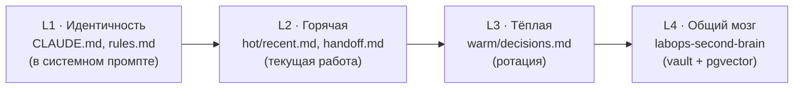
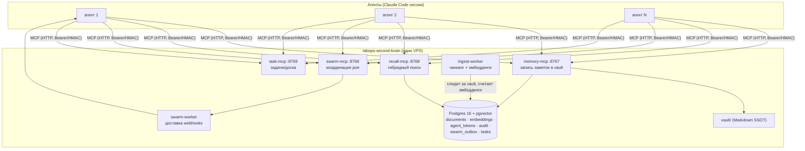

<p align="center">
  <picture>
    <source media="(prefers-color-scheme: dark)" srcset="assets/labops-logo-dark.svg">
    
  </picture>
</p>

<h1 align="center">labops-second-brain</h1>

<p align="center"><em>операционка с AI изнутри профессии</em></p>

<p align="center">
  <a href="https://labopsai.pro"></a>
  <a href="./LICENSE"></a>
  
</p>

<p align="center"><a href="README.md">English</a> · <a href="README.ru.md"><b>Русский</b></a></p>

<p align="center">
  <b>Система labops:</b>
  <a href="https://github.com/dediukhinpa/labops-tg-plugin">tg-plugin</a> ·
  <b>second-brain</b> ·
  <a href="https://github.com/dediukhinpa/labops-agent-architecture">agent-architecture</a>
</p>

> **Общий мозг команды Claude Code-агентов.** Self-hosted на одном VPS: Postgres 16 + pgvector, набор MCP-серверов (память, гибридный recall, координация роя, задачи) и фоновые воркеры. Markdown-vault как единый источник правды + семантический поиск поверх него. Часть архитектуры **labops** (см. [`labops-tg-plugin`](#часть-labops) и [`labops-agent-architecture`](#часть-labops)).

Это слой **долговременной общей памяти**. Каждый агент держит свою «горячую» память в workspace (`CLAUDE.md`, `hot/`, `warm/`), а `labops-second-brain` — это **L4**: смысловой, общий для всей команды, с поиском по эмбеддингам и строгим разграничением доступа.

> **Платформа:** заточено под **Linux + systemd + Postgres peer-auth** (OS-пользователь == pg-роль, обычно `second_brain`). Не Docker, не macOS/Windows.

---

## Зачем нужен общий мозг

Один агент помнит свою сессию. Команда агентов — нет: знание, добытое одним, недоступно другим, теряется при компакции и не ищется по смыслу. `labops-second-brain` решает это — общий слой, доступный всем агентам по MCP, со смысловым recall, dual-write (чтобы ничего не терялось при компакции), scoped RBAC и подписанными inter-agent webhooks вместо слепых прямых вызовов.

| Проблема | Решение |
|---|---|
| Знание заперто в одной сессии | общий слой, доступный всем агентам по MCP |
| Контекст теряется при компакции | важное пишется сразу в vault + БД (dual-write) |
| «Где-то я это уже видел» | семантический recall по эмбеддингам, не grep |
| Кто что может читать/писать | scopes + per-agent токены (RBAC) |
| Рой дёргает друг друга вслепую | inter-agent webhooks с подписью и ретраями |

---

## Quickstart

Если читать некогда — вот необходимый и достаточный набор.

**1. Запустить установщик** на чистом Ubuntu 22.04+ под root. Postgres 16 + pgvector он ставит сам из `apt.postgresql.org`:

```bash
sudo bash scripts/install.sh
```

**2. Заполнить только обязательные переменные** в `.env` (остальное генерируется/опционально — см. блок Quick Start в начале [`.env.example`](.env.example)):

- `PG_HOST` — хост БД (по умолчанию unix-сокет `/var/run/postgresql` → peer-auth, пароль не нужен), `PG_DATABASE`, `PG_USER`;
- `MCP_MEMORY_PORT` / `MCP_RECALL_PORT` / `MCP_SWARM_PORT` — порты серверов (дефолты `8767` / `8768` / `8766`);
- `PG_PASSWORD` нужен **только** при TCP-хосте; при peer-auth оставьте пустым.

Установка считается успешной только при зелёном **smoke-test** в конце (если он падает — см. [Troubleshooting](#troubleshooting)).

**3. Первая запись + запрос (через MCP).** Выдайте per-agent Bearer-токен на VPS, пропишите его в `.mcp.json` агента, затем пишите и ищите:

```bash
# выдать токен (печатается один раз — сохраните)
sudo -u second_brain python /opt/second_brain/scripts/issue-agent-token.py \
  --agent my-agent --scopes '*'
```

```jsonc
// ~/.claude/.mcp.json на хосте агента
{
  "mcpServers": {
    "second_brain-memory": { "url": "http://<VPS>:8767/mcp", "headers": { "Authorization": "Bearer <token>" } },
    "second_brain-recall": { "url": "http://<VPS>:8768/mcp", "headers": { "Authorization": "Bearer <token>" } },
    "second_brain-swarm":  { "url": "http://<VPS>:8766/mcp", "headers": { "Authorization": "Bearer <token>" } }
  }
}
```

```text
# запись — агент вызывает memory-инструмент
create_decision_note(title="Use pgvector for recall", body="...", scope="30-decisions")

# запрос — агент вызывает recall
recall(query="как мы храним эмбеддинги")
```

Проверить мозг напрямую, без агента:

```bash
curl -sS -H "Authorization: Bearer <token>" http://<VPS>:8768/mcp/
# ожидается 406 с телом MCP-ошибки (живой upstream). 401 → неверный токен. Connection refused → файрвол.
```

---

## Слои памяти



- **L1–L3 живут в workspace агента** (это слой [`labops-agent-architecture`](#часть-labops)) — личные, быстрые, в контексте сессии.
- **L4 — этот репозиторий** — общий, смысловой, переживает сессии и компакцию. Сюда выгружают решения, ошибки, исследования, заметки о человеке и проекте. Поиск — по смыслу, доступ — по scopes.

---

## Архитектура



- **MCP-серверы** — точки входа для агентов (HTTP, аутентификация Bearer-токеном или HMAC-подписью).
- **ingest-worker** — следит за изменениями vault, режет документы на чанки с контекстом и считает эмбеддинги (FastEmbed `multilingual-e5-large`).
- **swarm-worker** — асинхронно доставляет inter-agent webhooks с ретраями.
- **core-mcp** — режим, агрегирующий memory+swarm+task в одном процессе (см. tool-gating ниже).

### MCP-серверы и порты

| Сервер | Порт | Назначение | systemd |
|---|---|---|---|
| `memory-mcp` | **8767** | запись заметок в vault (decision/runbook/error/external/personal/project), дедуп по sha256 | `memory-mcp.service` |
| `recall-mcp` | **8768** | гибридный поиск (semantic + lexical + rerank), кросс-линки | `recall-mcp.service` |
| `swarm-mcp` | **8766** | координация роя: outbox, inter-agent сообщения | `swarm-mcp.service` |
| `task-mcp` | **8769** | задачи, доска, supervisor агентов | `task-mcp.service` |
| `ingest-worker` | — | чанкинг + эмбеддинги (watermark по изменениям) | `ingest-worker.service` |
| `swarm-worker` | — | доставка webhooks (5 ретраев, exp backoff) | `swarm-worker.service` |

**tool-gating:** переменная `SECOND_BRAIN_TOOLS` (дефолт `core`) определяет, какие инструменты сервер отдаёт клиентам. Новый memory-инструмент виден только если он есть в `CORE_TOOLS_BY_SERVER` (`services/shared/tool_gating.py`), а не только в коде.

---

## Хранилище: vault + Postgres

- **vault/** — каталог Markdown-файлов, **единственный источник правды** (human-readable, git-friendly). Каждая заметка = `.md` с YAML-frontmatter.
- **Postgres + pgvector** — индекс поверх vault: `documents`, `embeddings` (вектор на чанк), `agent_tokens` (RBAC), `audit` (кто что писал), `swarm_outbox`, `tasks`. БД — производная; правда — в vault.

Документ проходит: запись через `memory-mcp` → файл в vault + строка в `documents` → `ingest-worker` режет на чанки и считает эмбеддинги → доступен в `recall`.

> **Важно:** `ingest-worker` эмбеддит только то, что пришло через запись `memory-mcp` (строка в `documents` + задача в очереди). `.md`-файлы, **положенные в vault руками** (минуя `memory-mcp`), НЕ индексируются автоматически и не находятся в recall.

---

## Scopes и RBAC

Числовые префиксы (`10-`, `30-`, `90-`…) — это просто **папки верхнего уровня в vault**, по которым раскладывается знание (стратегия, решения, входящее и т.д.); цифры задают порядок и группировку, не приоритет. Каждый scope — отдельная «полка», и доступ к чтению/записи выдаётся по списку этих полок. Новичку проще всего выдать себе токен со `scopes='*'` (доступ ко всем полкам — удобно для админки и тестов) и сузить права позже, когда станет ясно, кому что нужно.

**Scope** = первая папка пути в vault. Разрешённый список — `services/memory_mcp/path_guard.py` (`ALLOWED_SCOPES`):

| Scope | Что хранит |
|---|---|
| `10-strategy` / `10-system` | стратегия, системные заметки |
| `15-personal` | про человека: ФИО, навыки, опыт, жизненные ситуации |
| `20-daily` / `20-metrics` | дневные логи, метрики |
| `30-decisions` | архитектурные/продуктовые решения |
| `40-projects` | бизнес: бухгалтерия, договора, регламенты, переписка, коммтайна |
| `50-external` / `50-knowledge` | внешние источники, исследования, статьи |
| `60-tasks` | задачи |
| `70-runbooks` | воспроизводимые процессы |
| `80-error-patterns` | баги и их фиксы |
| `90-inbox` | входящее, не разобранное |

**RBAC:** у каждого агента — токен в `agent_tokens` с `can_read_scopes` / `can_write_scopes`. `*` = доступ к любому scope. Токены выдаёт `scripts/issue-agent-token.py` (raw-секрет печатается один раз, в БД — sha256).

---

## Гибридный recall, dual-write, координация роя

<details>
<summary><b>Гибридный recall</b> — смысловой поиск, не grep</summary>

`recall-mcp` не grep, а смысловой поиск:

1. **Semantic** — эмбеддинг запроса (e5, с правильными префиксами `query:`/`passage:`) → cosine по pgvector.
2. **Lexical** — полнотекстовый сигнал.
3. **Fusion (RRF)** — объединение рангов semantic+lexical.
4. **Rerank** — переупорядочивание top-кандидатов.
5. **Cross-link** — связанные заметки (`cross_link.py`).

Кэш запросов-эмбеддингов (`recall_mcp/cache.py`) и веса источников (`source_weights.py`) — для скорости и релевантности.

</details>

<details>
<summary><b>dual-write</b> — политика записи</summary>

- **dual-write:** важное пишется в ДВА места сразу — локальный canonical `.md` (в workspace агента) **и** общий слой через `memory-mcp`. Идемпотентно по sha256 (повтор тела — no-op). Локальный `.md` — главный, second_brain — общий для команды.
- **recall перед записью** — чтобы не плодить дубли.
- **пиши сразу** — компакция/конец сессии НЕ выгружают знание автоматически.

Полная политика «что и когда писать» — в `labops-agent-architecture` (`SECONDBRAIN_WRITE_RULES.md`, @-импортится в CLAUDE.md каждого агента).

</details>

<details>
<summary><b>Координация роя (inter-agent)</b> — подписанные webhooks</summary>

Агенты дёргают друг друга через **inter-agent webhooks** (не напрямую):

- отправитель кладёт сообщение в `swarm_outbox` (через `swarm-mcp`);
- `swarm-worker` доставляет его получателю, статусы `pending|delivered|acked|failed`;
- **5 ретраев** с экспоненциальным backoff, потом `failed` (нужен ручной replay);
- запросы подписаны **HMAC** (`x-hermes-signature`/`x-hermes-timestamp`, секреты в `migrations/004_hmac_secrets.sql` + `issue-hmac-secret.py`), плюс Bearer-токены.

Подробности — `docs/INTER-AGENT-WEBHOOKS.md`.

</details>

---

## Инструменты записи

| Инструмент | Scope по умолчанию | Что фиксирует |
|---|---|---|
| `create_decision_note` | `30-decisions` | архитектурные/продуктовые решения, API-контракты, правила |
| `create_runbook_note` | `70-runbooks` | воспроизводимые процессы |
| `create_error_pattern_note` | `80-error-patterns` | баг + фикс + как не повторить |
| `create_external_note` | `50-external` | внешние источники/исследования (+ `source_url`) |
| `create_personal_note` | `15-personal` | про человека |
| `create_project_note` | `40-projects` | про бизнес/проект |
| `append_daily_log` | `20-daily` | дневной прогресс |
| `create_handoff` | — | выгрузка перед компакцией/в конце сессии |
| `supersede_decision` | `30-decisions` | устаревшее решение |

Recall: `recall(...)`. Координация: `swarm_*`. Задачи: `task_*`.

---

## Установка и деплой

<details>
<summary><b>Нативная установка (Ubuntu 22.04, без Docker)</b></summary>

Требования: **Ubuntu 22.04**, root/sudo. Без Docker — нативно (apt + venv + systemd).

```bash
sudo bash scripts/install.sh
```

Идемпотентные шаги: проверка платформы → apt (Python 3.11, Postgres 16 + pgvector, Caddy) → системный пользователь `second_brain` → `/opt/second_brain` + venv → роль/БД + расширение `vector` → секреты (0600) → миграции → предзагрузка модели эмбеддингов (`multilingual-e5-large`, ~1.3 ГБ) → рендер и установка systemd-юнитов → `systemctl enable --now` → **smoke-test** → печать admin-токена.

**Зависимость от других репо:**
- Если на машине **уже есть агенты** (поставлен [`labops-agent-architecture`](#часть-labops)) — установщик до-регистрирует их токены (`issue-agent-token.py`), не перетирая существующие.
- Если мозг ставится **первым** — токены агентам выдаются позже, при установке агентов.

Установка считается успешной только при зелёном **smoke-test** в конце.

Ручной, человеческий walkthrough (без Claude Code-агента) — [`docs/setup.md`](docs/setup.md).

</details>

<details>
<summary><b>Troubleshooting</b> — гейт smoke-test и <code>SKIP_SMOKE_GATE</code></summary>

**Smoke-test (или embedding-probe) роняет установку.** В самом конце `install.sh` прогоняет `smoke-test.sh` (живые MCP-сервисы + БД), а на шаге 11 — проверяет, что модель эмбеддингов реально считает вектор. Любой провал по умолчанию — **HARD-стоп** (`die`), установка считается неподтверждённой. Это намеренно: лучше красный гейт, чем «зелёная» установка с молча сломанным recall.

Разбор: `journalctl -u 'second_brain-*' -n 200`, затем повторить `sudo bash scripts/install.sh` (идемпотентно).

**Аварийный обход — `SKIP_SMOKE_GATE=1`.** Если нужно довести установку до конца, несмотря на падение гейта (например, сеть до сервиса ещё не поднялась, а вы чините её отдельно), запустите:

```bash
sudo SKIP_SMOKE_GATE=1 bash scripts/install.sh
```

Тогда провал smoke-test и embedding-probe становится **предупреждением**, а не остановкой. Используйте только осознанно и временно: установка с этим флагом **не подтверждена**, recall может быть деградирован до lexical-only. Уберите флаг и перезапустите, как только причина устранена.

</details>

---

## Переменные и порты

Полный референс — [`.env.example`](.env.example). Ключевое:

| Переменная | Назначение |
|---|---|
| `MCP_MEMORY_PORT` / `MCP_RECALL_PORT` / `MCP_SWARM_PORT` / `MCP_TASK_PORT` | порты серверов (8767/8768/8766/8769) |
| `SERVICE_USER` | системный пользователь (`second_brain`) |
| `INSTALL_DIR` | каталог установки (`/opt/second_brain`) |
| `DOMAIN` / `ACME_EMAIL` | для Caddy + TLS (опционально) |
| `WEBHOOK_BEARER_FILE` / `WEBHOOK_HMAC_SECRET_FILE` | секреты inter-agent auth |
| `SECOND_BRAIN_TOOLS` | tool-gating (`core` по умолчанию) |

> `.env.example` документирует и переменные смежных слоёв (агенты/скиллы/инсталлятор из `labops-agent-architecture`) — это полный референс экосистемы; для самого мозга достаточно перечисленных выше. См. блок Quick Start в начале [`.env.example`](.env.example).

**Тесты:**

```bash
# в активированном venv с зависимостями
python -m pytest tests/ -q
```

`scripts/install.sh` прогоняет `smoke-test.sh` в конце установки (живые сервисы + БД). Юнит/контрактные тесты (`tests/`, 400+) проверяют scopes, RBAC, tool-gating, recall, HMAC, swarm. `scripts/gbrain_doctor.py` / `scripts/check_env_sync.py` — диагностика окружения.

---

## Часть labops

| Репозиторий | Роль | Связь |
|---|---|---|
| [`labops-tg-plugin`](https://github.com/dediukhinpa/labops-tg-plugin) | Telegram-канал к сессии агента | независим |
| **labops-second-brain** (этот) | общий мозг: память + recall + координация | агенты ходят сюда по MCP |
| [`labops-agent-architecture`](https://github.com/dediukhinpa/labops-agent-architecture) | воркспейсы агентов, автостарт, Developer + скилл создания агентов | регистрирует токены здесь, пишет в L4 |

---

## Лицензия

Проприетарная (Proprietary) — © 2026 LabOps.ai. Все права защищены. См. [LICENSE](./LICENSE).
